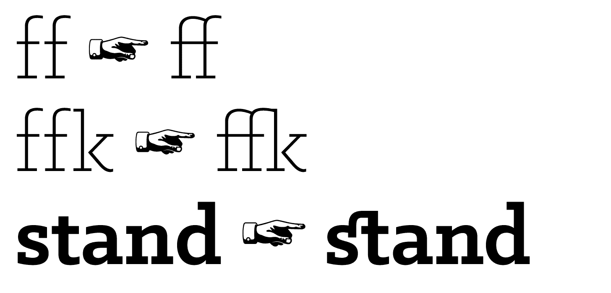

[](http://kennethormandy.com/journal/normalize-opentype-css)

***

# Normalize-OpenType.css

Adds OpenType features—ligatures, kerning, and more—to [Normalize.css](https://github.com/necolas/normalize.css).

Read the blog post: [Introducing Normalize-OpenType.css](http://kennethormandy.com/journal/normalize-opentype-css)

[](https://raw.githubusercontent.com/kennethormandy/normalize-opentype.css/master/normalize-opentype.css)

_Or use_

```bash
npm install kennethormandy/normalize-opentype.css
```

## Ligatures

First, normalize basic ligatures across browsers, and then get fancier, discretionary ligatures on `<h1>`, `<h2>`, and `<h3>`s.



## Numerals

Different situations require different numerals, depending on the context. Normalize-OpenType.css takes care of this for you, so you don’t need to know what combination of Proportional, Lining, Tabular, and Old-Style numerals you need to use.


## Small Capitals

Regular capitals draw a lot of attention in body copy. With Normalize-OpenType.css, anything wrapped in `<abbr>` will use small capitals instead. This works especially well with [Typogr.js](https://github.com/ekalinin/typogr.js) and equivalents.


## Kerning

Kerning is turned on by default everywhere, and carefully turned off where it isn’t appropriate. A monospaced typeface’s application is ruined when automatic kerning is turned on. This is not the case with Normalize-OpenType.css; your code blocks have been preserved.


## …and more

There’s more optimisations included, so you don’t have to think about them: Lining, tabular numerals in code blocks, uppercase fallbacks for small capitals, and proper subscript and superscripts.

## Getting started

Normalize-OpenType.css aims to be as easy to use as its namesake, Normalize.css. If it’s not that easy, please [open an issue](https://github.com/kennethormandy/normalize-opentype.css/issues). Get the latest version of the CSS file here:

[](https://raw.githubusercontent.com/kennethormandy/normalize-opentype.css/master/normalize-opentype.css)

Alternatively, use the package manager and build tool of your choice:

#### With npm

```
npm install kennethormandy/normalize-opentype.css
```

#### With Component

```bash
component install kennethormandy/normalize-opentype.css
```

#### With bower

```bash
bower install normalize-opentype.css
```

### Include

Though technically Normalize-OpenType.css is not dependent on Normalize.css, the intent expectation is that the former would not be used without the latter. If you’re dropping in stylesheets:

```html
<link src="css/normalize.css" rel="stylesheet" />
<link src="css/normalize-opentype.css" rel="stylesheet" />
```

If you’re using a preprocessor through something like [Harp](http://harpjs.com), you can import the files instead.

```scss
@import "normalize";
@import "normalize-opentype";
```

### Caveats

This library does the best it can with what it has. In order to use any of these optimisations, they must also be available in the font you are using.

I’m working on some blog posts and documentation about this, and will be [sending them out via email](http://kennethormandy.com/journal/newsletter) if you’re interested.

There’s also a bug in Open Sans on Windows 7, with IE10 and 11, that’s caused by `font-feature-settings`, which this stylesheet uses heavily. [We’re keeping an eye on it.](https://github.com/kennethormandy/normalize-opentype.css/issues/4)

## Running locally

If you’d like to see the test suite, or just want to view things locally, use the following:

```bash
git clone https://github.com/kennethormandy/normalize-opentype.css
cd normalize-opentype.css
npm install
```
To view the tests:

```bash
npm test
```

To compile any changes:

```bash
npm build
```

## Contributing

Thanks for considering contributing! There’s information about how to [get started with normalize-opentype here](CONTRIBUTING.md).

If you’re new to all this GitHub, Open Source, JavaScript, Node.js, testing, wow all this stuff seems really difficult I just want to make my sites better stuff, I get it. I’m still there, too. Feel free to [send me an email](mailto:kenneth@chloi.io) or [open an issue here](http://github.com/kennethormandy/normalize-opentype.css/issues) and I’ll do my best to share some resources that have helped me out.

## Colophon

Normalize-OpenType.css’ wordmark, examples, and some tests set in the [Klinic Slab](http://www.losttype.com/font_beta/?name=klinic), designed by [Joe Prince](https://dribbble.com/JoePrince). The manicules were designed by [Cade Cran](http://cadecran.com) for [Dan Gneiding](http://grayhood.com/)’s [Dude Hank Pro](http://www.losttype.com/font/?name=hankpro). Both are available through the wonderful [Lost Type Co-op](http://losttype.com).

Additional tests use [Fira](https://github.com/mozilla/Fira) from Mozilla, and [Source Code Pro](https://github.com/adobe/source-code-pro) from Adobe.

## License

[The MIT License (MIT)](LICENSE.md)

Copyright © 2014 [Kenneth Ormandy](http://kennethormandy.com) & [Chloi Inc.](http://chloi.io)
